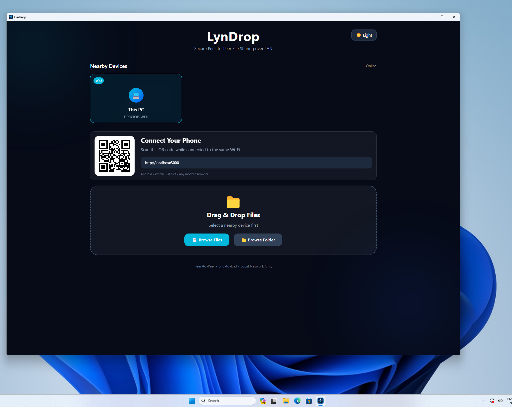
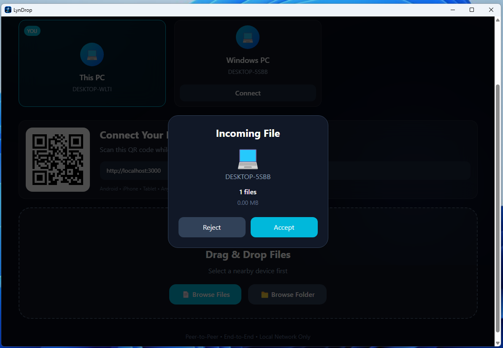
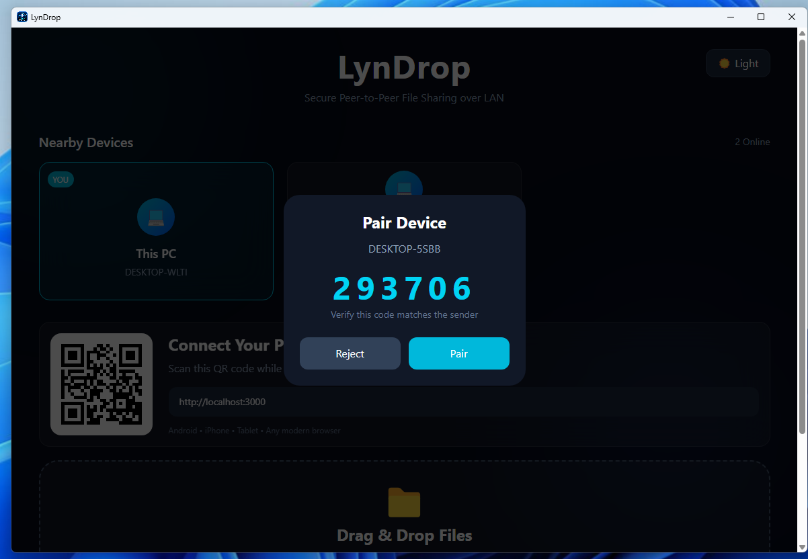
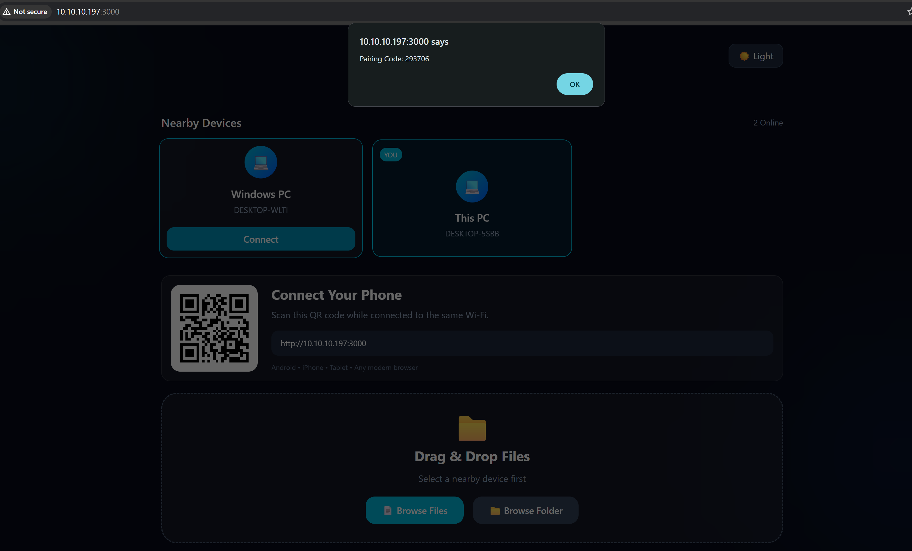
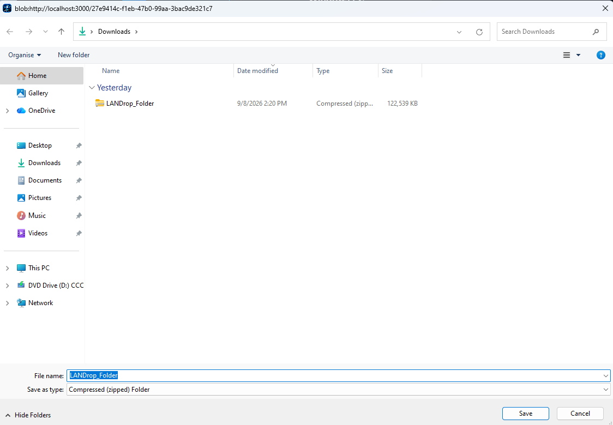

# 🚀 LynDrop

Fast peer-to-peer file transfer over your local network. No internet, no cloud, and no account required.

## Features

- ⚡ High-speed LAN file transfer
- 🔒 End-to-end peer-to-peer
- 📁 Send files & folders
- 🖼️ Photo/video thumbnails
- 🌙 Dark & Light theme
- 📱 Android, iPhone & Windows support
- 💻 One-click Windows installer

## Tech Stack

- React + Vite
- Electron
- Node.js
- Socket.IO
- WebRTC

## Installation

Download the latest installer from the **Releases** section and install LynDrop.

## License

MIT
# Screenshots

## Dashboard

---

## Incoming Code

---

## Pair

---

## Pairing Code

---

## Saved Files

